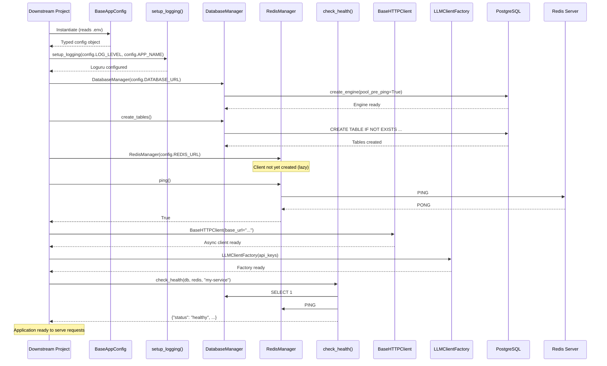

# Architecture — shared-core

## System Overview

`shared-core` is a Python library that provides 11 infrastructure modules shared across all projects in the Operator Systems showcase portfolio. It is not a standalone service — it has no process, no event loop, no API surface. Instead, it is installed as an editable package (`pip install -e ../shared-core`) and imported by each downstream project at startup.

The library solves a single problem: **preventing infrastructure code duplication across 10+ repositories** while ensuring consistent configuration, database access, logging, error handling, Redis connectivity, health checks, HTTP clients, LLM integration, task queues, metrics, and testing harnesses.

## Component Map

```mermaid
graph TD
    subgraph "shared-core library"
        CONFIG["config.py<br/>BaseAppConfig"]
        DB["database.py<br/>DatabaseManager<br/>AsyncDatabaseManager<br/>Base + BaseRepository"]
        LOG["logging.py<br/>setup_logging()<br/>RequestLoggingMiddleware"]
        ERR["errors.py<br/>10 Exception Classes<br/>application_error_handler"]
        REDIS["redis.py<br/>RedisManager<br/>@cache / RedisLock"]
        HEALTH["health.py<br/>check_health()"]
        CLIENTS["clients.py<br/>BaseHTTPClient"]
        LLM["llm.py<br/>LLMClientFactory<br/>estimate_llm_cost()"]
        TASKS["tasks.py<br/>create_celery_app()"]
        METRICS["metrics.py<br/>MetricsRegistry<br/>MetricsMiddleware"]
        TESTING["testing.py<br/>MockDatabase<br/>MockRedisClient"]
    end

    subgraph "External Dependencies"
        ENV[".env file"]
        PG["PostgreSQL<br/>(pgvector)"]
        RD["Redis Server"]
        STDOUT["stdout"]
        HTTP["External HTTP APIs"]
        LLM_API["OpenAI / Anthropic"]
        CELERY["Celery Workers"]
        PROM["Prometheus"]
    end

    subgraph "Downstream Projects"
        AWE["async-workflow-engine"]
        LCM["llm-cost-latency-monitor"]
        DIP["document-intelligence-pipeline"]
        REL["rag-evaluation-lab"]
        HAF["hermes-agent-framework"]
        ASS["ai-support-simulator"]
        GIA["github-issue-pr-agent"]
        KOS["personal-knowledge-base-os"]
        RAS["real-time-analytics-stack"]
        GSS["game-systems-sandbox"]
    end

    ENV --> CONFIG
    CONFIG --> DB
    CONFIG --> REDIS
    CONFIG --> LOG
    CONFIG --> CLIENTS
    CONFIG --> LLM
    CONFIG --> TASKS

    DB --> PG
    REDIS --> RD
    LOG --> STDOUT
    CLIENTS --> HTTP
    LLM --> LLM_API
    TASKS --> CELERY
    METRICS --> PROM

    CONFIG --> AWE & LCM & DIP & REL & HAF & ASS & GIA & KOS & RAS & GSS
    DB --> AWE & LCM & DIP & REL & KOS & RAS
    LOG --> AWE & LCM & DIP & REL & HAF & ASS & GIA & KOS & RAS & GSS
    ERR --> AWE & LCM & DIP & REL & HAF & ASS & GIA & KOS & RAS & GSS
    REDIS --> AWE & HAF & KOS & RAS
    HEALTH --> AWE & LCM & DIP & REL & HAF & KOS & RAS
    CLIENTS --> AWE & LCM & DIP & HAF & ASS & GIA & RAS
    LLM --> LCM & REL & HAF & ASS & KOS
    TASKS --> AWE
    METRICS --> AWE & LCM & KOS & RAS
    TESTING --> AWE & LCM & DIP & REL & HAF & ASS & GIA & KOS & RAS & GSS
```

## Module Responsibilities

### `config.py` — Configuration Loading

- **Class:** `BaseAppConfig(BaseSettings)`
- **Reads from:** `.env` file in the working directory (via `SettingsConfigDict`)
- **Provides:** `APP_NAME`, `ENV`, `DEBUG`, `DATABASE_URL`, `REDIS_URL`, `LOG_LEVEL`, `OPENAI_API_KEY`, `ANTHROPIC_API_KEY`, `GITHUB_TOKEN`, LLM settings (model names, temperature, max tokens), Celery broker/backend URLs, CORS origins, database pool parameters
- **Extension pattern:** Downstream projects subclass `BaseAppConfig` to add project-specific fields
- **`extra="ignore"`** means unrecognized environment variables are silently discarded
- **`validate_config()`** classmethod returns a list of config issues (field, message, severity) without raising

### `database.py` — Database Connectivity

- **Classes:** `DatabaseManager`, `AsyncDatabaseManager`, `BaseRepository[T]`
- **Singleton:** `Base = declarative_base()` — shared ORM metadata registry
- **Mixins:** `UUIDMixin` (UUID string PK), `TimestampMixin` (created_at, updated_at)
- **Sync engine:** `DatabaseManager` with configurable `pool_size`, `max_overflow`, `pool_timeout`, `pool_pre_ping=True`
- **Async engine:** `AsyncDatabaseManager` with SQLAlchemy `AsyncSession` and `asyncpg` driver — same pool parameters, async `get_session()` generator, `create_tables()`, and `close()`
- **Repository:** `BaseRepository[T]` provides generic `get`/`list`/`create`/`update`/`delete` CRUD operations

### `logging.py` — Structured Logging

- **Function:** `setup_logging(level: str, service_name: str) -> None`
- **Sink:** `sys.stdout` with Loguru colorized formatting
- **Format:** `{timestamp} | {level} | {service} | {correlation_id} | {module}:{function}:{line} - {message}`
- **Middleware:** `RequestLoggingMiddleware` — generates/forwards `X-Correlation-ID`, logs method/path/status/duration per request
- **ContextVar:** `correlation_id_var` for manual correlation ID propagation across async tasks
- **Behavior:** Removes all existing handlers on each call, then adds a single stdout handler

### `errors.py` — Exception Hierarchy

- **Base:** `BaseApplicationError(Exception)` with `message`, `code`, `status_code` attributes
- **10 subclasses** covering common HTTP error semantics (400, 401, 403, 404, 409, 500, 502)
- **Handler:** `application_error_handler` — ready-to-use FastAPI exception handler returning consistent JSON
- **Design:** Every exception carries enough metadata for a FastAPI exception handler to produce a JSON error response without additional mapping

### `redis.py` — Redis Connectivity

- **Class:** `RedisManager`
- **Lazy init:** `_client` is `None` until first `.client` property access
- **Connection:** `redis.Redis.from_url(redis_url, decode_responses=True)`
- **Health check:** `ping()` catches `redis.RedisError` and returns `bool` — never raises
- **Retry connect:** `connect(max_retries, backoff_factor)` — eager connection with exponential backoff
- **Shutdown:** `close()` — explicitly closes the Redis client connection pool
- **`@cache` decorator:** MD5-hashed argument keys, JSON serialization, supports sync and async functions
- **`RedisLock`:** Distributed lock with sync and async context managers, atomic release via Lua script

### `health.py` — Health Checks

- **Function:** `check_health(db_manager, redis_manager, service_name) -> dict`
- **Checks:** Runs `SELECT 1` on the database, pings Redis
- **Response:** `{"status": "healthy"|"degraded", "service": ..., "dependencies": {"database": "online"|"offline", "redis": "online"|"offline"}}`
- **Design:** Simple function (not a class) — downstream projects call it directly in their health endpoints

### `clients.py` — HTTP Client Abstraction

- **Class:** `BaseHTTPClient`
- **Client:** `httpx.AsyncClient` with configurable base URL, timeout, max retries, backoff factor
- **Retry:** Exponential backoff on 5xx status codes — configurable max retries and backoff factor
- **Correlation ID:** Automatically forwards `X-Correlation-ID` from `correlation_id_var` context
- **Convenience:** `get()`, `post()`, `put()`, `delete()` methods wrapping the retry logic
- **Cleanup:** `close()` method to explicitly shut down the connection pool

### `llm.py` — LLM Integration

- **Classes:** `LLMClientFactory`, `LLMResponse`
- **Function:** `estimate_llm_cost(model, prompt_tokens, completion_tokens) -> float`
- **Dynamic imports:** `openai` and `anthropic` SDKs are imported at call time — they remain optional dependencies
- **Clients:** `get_openai_client()`, `get_anthropic_client()` — synchronous client factories
- **Generation:** `generate_openai()`, `generate_anthropic()` — async completion calls returning standardized `LLMResponse`
- **Mock:** `generate_mock()` — fast in-memory response for unit tests (no API calls)
- **Cost tracking:** Static rate table for 4 models (gpt-4o, gpt-4o-mini, claude-3-5-sonnet, claude-3-haiku)

### `tasks.py` — Celery Bootstrap

- **Function:** `create_celery_app(service_name, broker_url, backend_url) -> Celery`
- **Dynamic import:** `celery` is imported at call time — optional dependency
- **Configuration:** JSON serialization, UTC timezone, task time limit (3600s), task_track_started
- **Signals:** Automatic Loguru logging on `task_prerun`, `task_postrun`, `task_failure`

### `metrics.py` — Observability

- **Class:** `MetricsRegistry` — holds pre-defined Prometheus metrics
- **Middleware:** `MetricsMiddleware` — FastAPI middleware that instruments request count, duration per endpoint
- **Endpoint:** `metrics_endpoint(registry)` — returns a FastAPI endpoint function for Prometheus scraping
- **Dynamic import:** `prometheus_client` is imported at runtime — optional dependency
- **Metrics:** `http_requests_total` (Counter), `http_request_duration_seconds` (Histogram), `db_connections_active` (Gauge), `errors_total` (Counter)

### `testing.py` — Test Harnesses

- **Classes:** `MockDatabase`, `MockRedisClient`
- **MockDatabase:** In-memory SQLite engine with `Base.metadata.create_all()` pre-run, same `get_session()` generator interface
- **MockRedisClient:** Full in-memory mock — `get`, `set` (with `ex`/`px`/`nx`), `setex`, `delete`, `eval` (Lua lock release simulation), TTL expiration
- **Purpose:** Downstream projects use these in their test suites for isolated unit tests without Docker

## Data Flow

There is no runtime data flow within `shared-core` itself — it is a library consumed at import time. The typical data flow in a downstream project using all modules:

## Storage Model

`shared-core` defines no database tables of its own. It provides:

1. **`Base`** — the SQLAlchemy `declarative_base()` instance that all downstream ORM models must inherit from
2. **`UUIDMixin`** / **`TimestampMixin`** — standard column mixins for model definitions
3. **`DatabaseManager.create_tables()`** / **`AsyncDatabaseManager.create_tables()`** — calls `Base.metadata.create_all()` to create tables registered by any project that imported `Base`
4. **`BaseRepository[T]`** — generic CRUD operations that downstream repos can use or subclass

Each downstream project defines its own models inheriting from `Base` and is responsible for its own schema.

## Failure Handling

Error propagation in `shared-core` follows these patterns:

| Module | Failure Behavior |
|--------|------------------|
| `BaseAppConfig` | Raises `pydantic.ValidationError` at instantiation if required fields are missing or invalid. `validate_config()` returns issues list without raising. |
| `DatabaseManager.__init__` | SQLAlchemy `create_engine` is lazy — no connection is made until first query |
| `DatabaseManager.get_session` | Session is always closed in `finally` block; exceptions from queries propagate to caller |
| `DatabaseManager.create_tables` | Raises `sqlalchemy.exc.OperationalError` if database is unreachable |
| `AsyncDatabaseManager` | Same patterns as sync, plus `close()` for explicit engine disposal |
| `setup_logging` | Cannot fail — writes to stdout, no I/O dependencies |
| `RedisManager.ping` | Catches `redis.RedisError` internally, returns `False` — never raises |
| `RedisManager.client` | Raises `redis.ConnectionError` on first access if Redis URL is malformed or server is down |
| `RedisManager.connect` | Retries with exponential backoff before raising |
| `check_health` | Catches all exceptions internally — returns `"degraded"` with per-dependency status, never raises |
| `BaseHTTPClient` | Retries on 5xx with exponential backoff, raises `httpx.HTTPError` after exhausting retries |
| `LLMClientFactory` | Dynamic imports raise `ImportError` with install instructions. API failures propagate from SDK. `generate_mock()` never raises. |
| `create_celery_app` | Dynamic import raises `ImportError` if Celery not installed. Signal handlers catch and log task failures. |
| `MetricsMiddleware` | Fails silently — metrics errors never affect request handling |
| `MockDatabase` | `create_all()` is called at init — downstream must register models before instantiation |
| `MockRedisClient` | Never raises — in-memory operations always succeed |

## External Dependencies

| Dependency | Purpose | Required At |
|------------|---------|-------------|
| PostgreSQL (any version with pgvector) | Database backend | Runtime (when `DatabaseManager`/`AsyncDatabaseManager` is used) |
| Redis | Caching, queuing, pub/sub, locks | Runtime (when `RedisManager` is used) |
| `.env` file | Configuration source | Import time (when `BaseAppConfig` is instantiated) |
| External HTTP services | API targets for `BaseHTTPClient` | Runtime (when client methods are called) |
| OpenAI / Anthropic APIs | LLM completions | Runtime (when `generate_openai()`/`generate_anthropic()` called) |
| Celery workers | Background task execution | Runtime (when tasks are dispatched) |
| Prometheus | Metrics scraping | Runtime (when `/metrics` endpoint is queried) |

None of these are required for import — `shared-core` can be imported without any infrastructure running. Failures only occur when modules are actually used.

## Security Boundaries

See [security.md](security.md) for full details. Key points:

- **No data storage** — `shared-core` stores nothing; it provides access patterns only
- **Credentials in environment** — `DATABASE_URL`, `REDIS_URL`, and API keys are loaded from `.env` and held in memory
- **No encryption** — database connections use whatever the connection string specifies (SSL is opt-in via URL parameters)
- **No authentication** — `shared-core` provides no auth mechanisms; downstream projects implement their own
- **Trust boundary** — the library trusts the `.env` file and the filesystem implicitly
