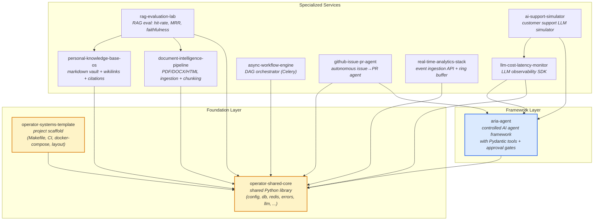

# Operator Systems — Workspace Map

A coordinated portfolio of production-pattern Python services, all built on a shared foundation. This page is the canonical map of how the repos fit together.

> **TL;DR** — `operator-shared-core` is the foundation library. `operator-systems-template` is the project scaffold. Everything else is a specialized service that uses both.

---

## Architecture

---

## Repositories

### Foundation (used by all services)

| Repo | Purpose | Stack |
|------|---------|-------|
| [operator-shared-core](https://github.com/FishRaposo/operator-shared-core) | Shared library: config (Pydantic), database (SQLAlchemy 2.0), redis, errors, logging (Loguru), LLM client, metrics, Celery, testing mocks | Python 3.10+ / Pydantic v2 / SQLAlchemy 2.0 |
| [operator-systems-template](https://github.com/FishRaposo/operator-systems-template) | Project scaffold: Makefile, CI, Docker Compose, directory layout. New projects fork from this. | Python 3.10+ / FastAPI / Postgres pgvector / Redis |

### Framework

| Repo | Purpose | Stack |
|------|---------|-------|
| [aria-agent](https://github.com/FishRaposo/aria-agent) | Controlled AI agent framework: Pydantic-validated tools, human approval gates, conversation memory, Celery workers, audit trails | FastAPI / Pydantic v2 / Celery |

### Specialized Services (each uses the foundation)

| Repo | What it does | Pillar |
|------|--------------|--------|
| [rag-evaluation-lab](https://github.com/FishRaposo/rag-evaluation-lab) | Quantitative RAG evaluation: hit-rate, MRR, faithfulness, citation coverage, latency, cost | RAG / AI Evaluation |
| [document-intelligence-pipeline](https://github.com/FishRaposo/document-intelligence-pipeline) | Multi-format document ingestion (PDF, DOCX, HTML), semantic chunking, embedding generation | RAG / Data |
| [personal-knowledge-base-os](https://github.com/FishRaposo/personal-knowledge-base-os) | Local-first markdown vault: Obsidian-style wikilinks, bidirectional backlinks graph, citation-grounded chat | Knowledge / RAG |
| [llm-cost-latency-monitor](https://github.com/FishRaposo/llm-cost-latency-monitor) | LLM observability SDK: token costs, latency, model usage, per-request telemetry | AI Observability |
| [ai-support-simulator](https://github.com/FishRaposo/ai-support-simulator) | LLM-powered customer support simulator: configurable personas, scenario scripting, evaluation | AI Agents / Evaluation |
| [async-workflow-engine](https://github.com/FishRaposo/async-workflow-engine) | DAG-based async workflow orchestrator: Celery, dependency resolution, retry policies | Infrastructure |
| [github-issue-pr-agent](https://github.com/FishRaposo/github-issue-pr-agent) | Autonomous GitHub issue-to-PR agent: reads issues, plans, edits sandboxed repos, runs tests, opens draft PRs | AI Agents / DevTools |
| [real-time-analytics-stack](https://github.com/FishRaposo/real-time-analytics-stack) | High-throughput event ingestion API: in-memory ring buffer, JSONL persistence, query API | Infrastructure |

### Experimental / Sandboxes

| Repo | What it is |
|------|------------|
| [game-systems-sandbox](https://github.com/FishRaposo/game-systems-sandbox) | TypeScript + Python hybrid RPG simulator. Outside the operator-systems pattern; explores an unrelated area. |

---

## The Four Pillars (AI Infrastructure)

The services above cover four recurring concerns in production AI:

1. **RAG** — `rag-evaluation-lab` · `document-intelligence-pipeline` · `personal-knowledge-base-os`
2. **AI Observability** — `llm-cost-latency-monitor` · `aria-agent` (built-in tracing)
3. **AI Evaluation** — `rag-evaluation-lab` · `ai-support-simulator`
4. **Agent Infrastructure** — `aria-agent` · `github-issue-pr-agent`

Cross-cutting: every Python service imports from `operator-shared-core` for config, database, redis, errors, and logging.

---

## Conventions

All repos in the operator-systems family share the same baseline:

- **Python 3.10+**, type-checked with [pyright](https://github.com/microsoft/pyright)
- **Lint/format** with [ruff](https://github.com/astral-sh/ruff)
- **Tests** with [pytest](https://pytest.org/) (each repo aims for ≥80% of public surface)
- **Container infra** via Docker Compose: `pgvector/pgvector:pg16` + `redis:7-alpine`
- **CI** via GitHub Actions: ruff lint + format check + pytest on every push
- **`AGENTS.md`** in each repo for AI coding assistants to pick up the conventions automatically
- **`Makefile`** with `install`, `dev`, `test`, `lint`, `format`, `typecheck`, `docker-up`, `docker-down`, `demo`, `clean`

---

## Roadmap

This is a living document. When new services are added to the operator-systems family, add a row to the appropriate table and update the Mermaid graph. The map should always reflect reality.
